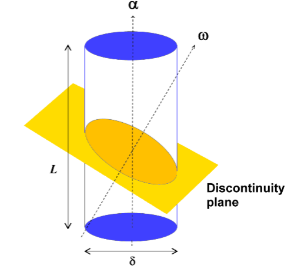

# Markdown 语法汇总
——By Jason Han

## 一、公式相关
### 1. 希腊字母
1. **$\Alpha$** \Alpha，**$\alpha$** \alpha
2. **$\Beta$** \Beta，**$\beta$** \beta
3. **$\Gamma$** \Gamma，**$\gamma$** \gamma
4. **$\Sigma$** \Sigma，**$\sigma$** \sigma
5. **$\Omega$** \Omega，**$\omega$** \omega

### 2. 运算符号
1. **加号** +
2. **减号** -
3. **乘号** \times， 示例：\$a \times b \$，显示：$a\times b$
4. **除号** \div， 示例：\$a \div b \$，显示：$a\div b$
5. **分数** \frac，示例：\$\frac{a}{b}\$，显示：$\frac{a}{b}$

### 3. 公式布置
1. **公式靠左** \$公式\$
2. **公式居中** \$\$公式\$\$

## 二、图片相关
很多地方都要借助于html语法
1. **添加图片**
   **方式1**：\!\[图片名称]\(图片路径)，其中图片路径可以是相对路径也可以是绝对路径。
   示例：\!\[钻孔中裂隙示意图](images/钻孔中裂隙示意图.png)
   **方式2**：\
   示例：\

## 三、文本相关
